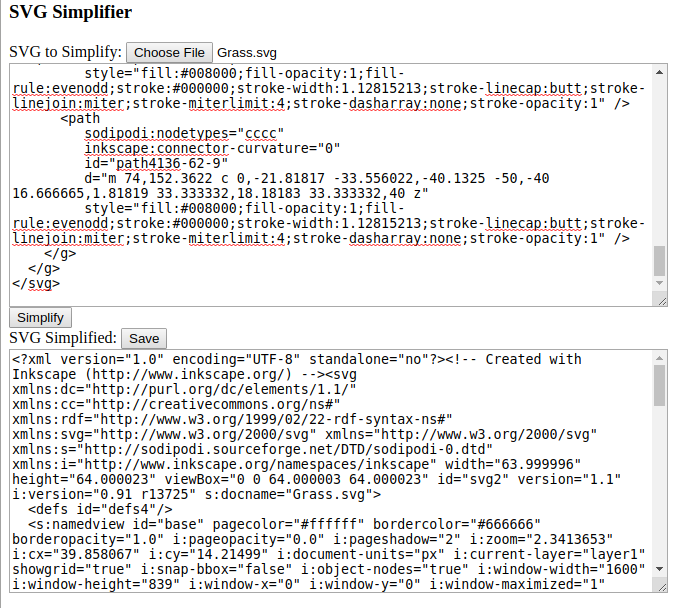

SVG Simplifier
==============

The JavaScript code in this repository allows an SVG vector image file to be uploaded, converted into a smaller, simpler version of itself, and re-saved.

To run, open the file SvgSimplifier.html in a web browser that runs JavaScript.

As of this writing, the program mostly just rounds off path points to the nearest pixel, abbreviates path names, and replaces the verbose "inkscape" and "sodipodi" names with something terser.  When run against the included test .svg, it results in a reduction in file size from 5.5 kiB to 4.2 kiB.

